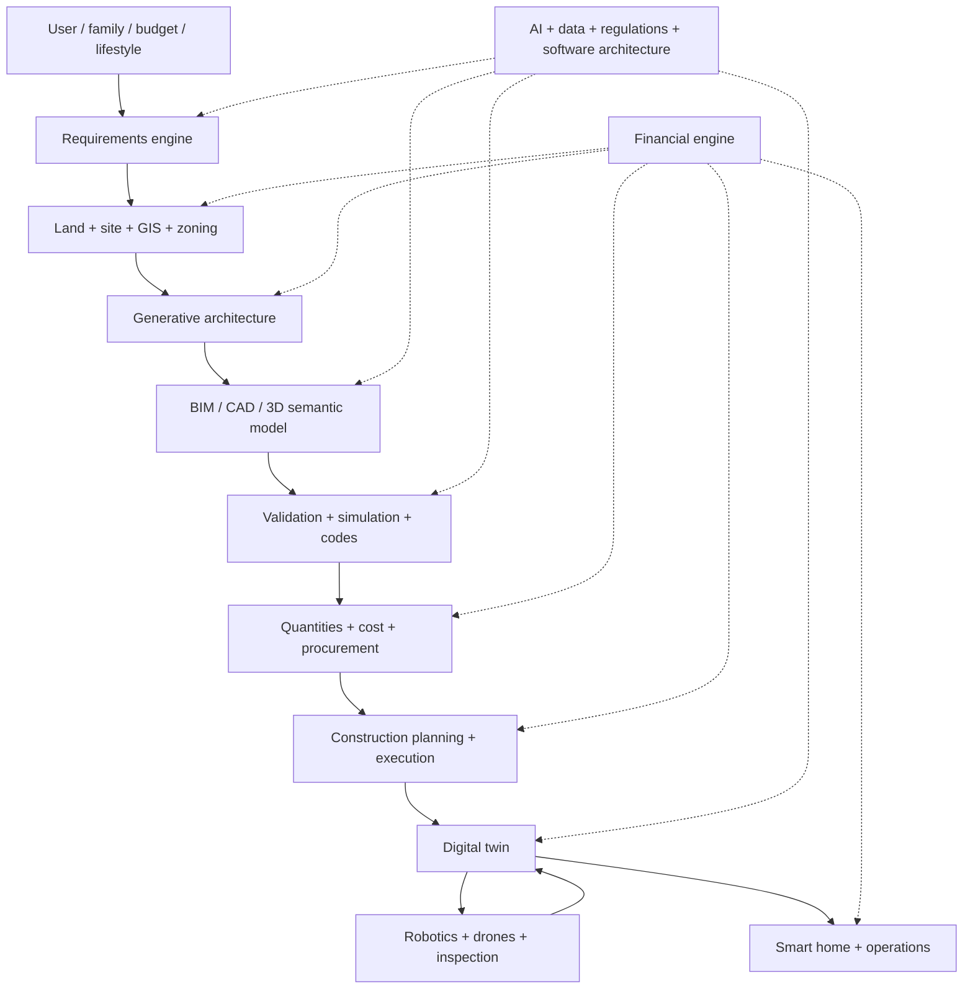
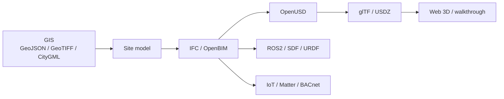

# Residential AI Development Platform

**Research knowledge base — requirements, ecosystem map, and technology landscape**

> Phase: **DISCOVER → RESEARCH → REQUIREMENTS → ECOSYSTEM MAP → GAPS**  
> Not implementation. No final stack choice.  
> Research snapshot: **19 September 2026**. Sources are primary where possible. Unverified claims are marked.

[](#what-this-is)
[](#category-index)
[](#quality-rules)

---

## What this is

This repository is a **navigable research pack** for an end-to-end AI-powered residential development system:

**land → requirements → generative design → BIM/CAD → validation → cost/procurement → construction → digital twin → robotics → home operations**

It answers, at research depth:

- What would be required to build the system
- What already exists (open source, commercial, academic)
- What can be reused
- Which APIs, datasets, and standards matter
- Where the real integration gaps are

It does **not** implement the platform.

---

## Visual process guide

Thirty images. Open this README in the repo folder (or on GitHub) and scroll. Nothing to click one-by-one.

Same-folder companion: [`visuals/process/README.md`](visuals/process/README.md).

| # | Stage |
|---|---|
| 01 | [Complete system map](#v01) |
| 02 | [How to read this pack](#v02) |
| 03 | [User brief](#v03) |
| 04 | [Requirements engine](#v04) |
| 05 | [Land + GIS](#v05) |
| 06 | [Terrain + elevation](#v06) |
| 07 | [Zoning envelope](#v07) |
| 08 | [Climate, sun, wind, flood](#v08) |
| 09 | [Room adjacency](#v09) |
| 10 | [Generative floor plans](#v10) |
| 11 | [Score alternatives](#v11) |
| 12 | [Massing + orientation](#v12) |
| 13 | [CAD + geometry](#v13) |
| 14 | [BIM / IFC](#v14) |
| 15 | [Structure](#v15) |
| 16 | [MEP](#v16) |
| 17 | [Building physics](#v17) |
| 18 | [Validation](#v18) |
| 19 | [Interior + FF&E](#v19) |
| 20 | [Rendering + web 3D](#v20) |
| 21 | [Quantities + cost](#v21) |
| 22 | [Procurement](#v22) |
| 23 | [Construction 4D](#v23) |
| 24 | [As-built vs design](#v24) |
| 25 | [Digital twin](#v25) |
| 26 | [Robotics + inspection](#v26) |
| 27 | [Smart home](#v27) |
| 28 | [Finance layer](#v28) |
| 29 | [Standards](#v29) |
| 30 | [Gaps + first slice](#v30) |

<a id="v01"></a>
### 01. Complete system map

One object graph from dirt to operations.


<a id="v02"></a>
### 02. How to read this pack

Open README in this folder. Images render inline.


<a id="v03"></a>
### 03. User brief

The family does not speak IFC. Start with a brief.


<a id="v04"></a>
### 04. Requirements engine

Prose in. Constraint JSON out.


<a id="v05"></a>
### 05. Land + GIS

Parcel, footprints, roads, utilities. BC title = LTSA.


<a id="v06"></a>
### 06. Terrain + elevation

Slope, pad, drain. DEM not a screenshot.


<a id="v07"></a>
### 07. Zoning envelope

Setbacks + height + FSR become a 3D volume.


<a id="v08"></a>
### 08. Climate, sun, wind, flood

Pretty plans that fail physics are theatre.


<a id="v09"></a>
### 09. Room adjacency

A house is a graph before it is a drawing.


<a id="v10"></a>
### 10. Generative floor plans

Many legal alternatives beat one hallucination.


<a id="v11"></a>
### 11. Score alternatives

Daylight, circulation, code flags, cost shape, adapt.


<a id="v12"></a>
### 12. Massing + orientation

Climate-aware volume on the lot.


<a id="v13"></a>
### 13. CAD + geometry

Solids, meshes, clouds, implicits are not the same.


<a id="v14"></a>
### 14. BIM / IFC

Semantics. Meshes without classes are pictures.


<a id="v15"></a>
### 15. Structure

Load path to the ground. Rare in generative plans.


<a id="v16"></a>
### 16. MEP

Air, power, water. OSS routing is a gap.


<a id="v17"></a>
### 17. Building physics

EnergyPlus, Radiance, gbXML, EPW.


<a id="v18"></a>
### 18. Validation

IDS, clash, codes, energy, human review.


<a id="v19"></a>
### 19. Interior + FF&E

No public SKU+3D+price+lead-time API.


<a id="v20"></a>
### 20. Rendering + web 3D

glTF to decide. Photoreal to persuade.


<a id="v21"></a>
### 21. Quantities + cost

Typed model = query. Pretty mesh = guesswork.


<a id="v22"></a>
### 22. Procurement

A SKU with a lead time is what gets bought.


<a id="v23"></a>
### 23. Construction 4D

Sequence + trades. Layout robots exist; SF masons do not.


<a id="v24"></a>
### 24. As-built vs design

Reality is the authority. The model catches up.


<a id="v25"></a>
### 25. Digital twin

Physical ↔ sensors ↔ state ↔ simulation ↔ decision.


<a id="v26"></a>
### 26. Robotics + inspection

Plan geometry must be localizable.


<a id="v27"></a>
### 27. Smart home

Home Assistant + Matter. Map devices to rooms.


<a id="v28"></a>
### 28. Finance layer

Models only. No investment advice.


<a id="v29"></a>
### 29. Standards

The joints are the product.


<a id="v30"></a>
### 30. Gaps + first slice

Own one slice. Treat the rest as adapters.


---

## How to navigate

```
HOME
 ├─ System map          (this file)
 ├─ Requirements        /requirements
 ├─ Ecosystem           /ecosystem   ← GitHub, companies, datasets, papers, APIs, standards
 ├─ Architecture        /architecture
 ├─ Gaps & questions    /decisions
 └─ Google prompts      /prompts    ← modular Deep Research prompts
```

| I want to… | Go here |
|---|---|
| Understand the whole pipeline | [System map](#complete-system-map) |
| Jump to a category | [Category index](#category-index) |
| See reusable code | [ecosystem/GITHUB_REPOS.md](ecosystem/GITHUB_REPOS.md) |
| See vendors | [ecosystem/COMPANIES.md](ecosystem/COMPANIES.md) |
| See training data | [ecosystem/DATASETS.md](ecosystem/DATASETS.md) |
| See papers | [ecosystem/PAPERS.md](ecosystem/PAPERS.md) |
| See APIs | [ecosystem/APIS.md](ecosystem/APIS.md) |
| See formats/standards | [ecosystem/STANDARDS.md](ecosystem/STANDARDS.md) |
| See how pieces connect | [architecture/INTEGRATION_MAP.md](architecture/INTEGRATION_MAP.md) |
| See what does **not** exist | [decisions/TECHNOLOGY_GAPS.md](decisions/TECHNOLOGY_GAPS.md) |
| Run deeper Google research | [prompts/GOOGLE_DEEP_RESEARCH.md](prompts/GOOGLE_DEEP_RESEARCH.md) |

---

## Complete system map



### Pipeline in words

```
USER
  │  family, lifestyle, budget, location, rooms, style,
  │  accessibility, sustainability, future needs
  ▼
REQUIREMENTS  →  machine-readable constraints + objectives
  ▼
LAND + SITE   →  GIS, terrain, soil, zoning, sun, wind, flood, utilities
  ▼
GENERATIVE ARCHITECTURE  →  floor plans, adjacency, envelope, alternatives
  ▼
BIM / CAD / 3D  →  architecture + structure + MEP + furniture + semantics
  ▼
VALIDATION  →  codes, structure, energy, daylight, clashes, accessibility
  ▼
COST + PROCUREMENT  →  takeoff, suppliers, lead times, schedule
  ▼
CONSTRUCTION  →  workforce, sequencing, inspection, as-built
  ▼
DIGITAL TWIN  →  BIM + 3D + sensors + history
  ▼
ROBOTICS + HOME OPS  →  SLAM, inspection, HVAC, maintenance
```

---

## The five bridges that actually matter

These are the connections that turn a pile of tools into a system:

1. **GIS ↔ BIM** — parcel, zoning, terrain, and setbacks must become the building envelope, not a screenshot.
2. **Building physics ↔ visual design** — a pretty plan that fails energy, moisture, or daylight is not a product.
3. **Constraint-based generation** — options must satisfy spatial, structural, financial, and regulatory constraints together.
4. **Lifecycle data sync** — design, quantities, cost, schedule, and as-built must stay the same object graph.
5. **Digital twin ↔ robotics** — planned geometry must be localizable, inspectable, and comparable to reality.

---

## Category index

### Original 15 headline groups

| # | Headline | Research file |
|---|---|---|
| 1 | Land, Site & Environmental Analysis | [requirements/LAND_SITE.md](requirements/LAND_SITE.md) |
| 2 | Requirements & Design Intelligence | [requirements/REQUIREMENTS_ENGINEERING.md](requirements/REQUIREMENTS_ENGINEERING.md) |
| 3 | Image Processing & Computer Vision | [research/IMAGE_PROCESSING.md](research/IMAGE_PROCESSING.md) |
| 4 | 3D Modeling, CAD & Geometry | [requirements/CAD_3D.md](requirements/CAD_3D.md) |
| 5 | BIM & Building Engineering | [requirements/BIM.md](requirements/BIM.md) |
| 6 | Interior Design, Furniture & Appliances | [requirements/INTERIOR_DESIGN.md](requirements/INTERIOR_DESIGN.md) |
| 7 | Rendering, Visualization & Virtual Experiences | [requirements/RENDERING.md](requirements/RENDERING.md) |
| 8 | Construction Planning & Execution | [requirements/CONSTRUCTION.md](requirements/CONSTRUCTION.md) |
| 9 | Finance, Feasibility & Investment | [requirements/FINANCE.md](requirements/FINANCE.md) |
| 10 | Digital Twins & Building Simulation | [requirements/DIGITAL_TWIN.md](requirements/DIGITAL_TWIN.md) |
| 11 | Robotics, Drones & Autonomous Inspection | [requirements/ROBOTICS.md](requirements/ROBOTICS.md) |
| 12 | Smart Home & Building Operations | [requirements/SMART_HOME.md](requirements/SMART_HOME.md) |
| 13 | AI, Data & Recommendation Systems | [research/AI_MODELS.md](research/AI_MODELS.md) |
| 14 | Software Architecture & Platform Infrastructure | [architecture/SYSTEM_ARCHITECTURE.md](architecture/SYSTEM_ARCHITECTURE.md) |
| 15 | Research & Ecosystem Discovery | this README + `/ecosystem` |

### Expansion groups 16–25

| # | Headline | Why it exists |
|---|---|---|
| 16 | Building Science & Physical Performance | Heat, moisture, IAQ, acoustics, carbon — not just geometry |
| 17 | Human-Centered Design & Spatial Intelligence | Ergonomics, aging-in-place, privacy, lifestyle models |
| 18 | Materials, Manufacturing & Modular Construction | DfMA, prefab, 3D print, circular materials |
| 19 | GIS & Urban Intelligence | Parcel, transit, city-scale 3D, regional cost |
| 20 | Legal, Regulatory & Risk | Permits, bylaws, title, insurance, audit trail |
| 21 | Project Management & Real-World Delivery | RFIs, change orders, delay/overrun prediction, handover |
| 22 | Advanced AI & Computational Design | GNNs, NeRF, Gaussian splatting, PINNs, inverse design |
| 23 | Data Standards & Interoperability | IFC, CityGML, gbXML, OpenUSD, glTF, COBie, BCF |
| 24 | Testing, Validation & Trustworthiness | Geometry tests, sim calibration, AI reliability |
| 25 | Business Model & Product Strategy | Who pays, MVP slice, marketplace vs SaaS |

Full requirement records live in [requirements/MASTER_REQUIREMENTS.md](requirements/MASTER_REQUIREMENTS.md).

---

## High-signal ecosystem (verified 2026-09-19)

This is the short list an engineer should know first. Full tables are in `/ecosystem`.

### Open source — high relevance

| Project | Role | Stars (verified) | License | Activity |
|---|---|---|---|---|
| [FreeCAD](https://github.com/FreeCAD/FreeCAD) | Parametric CAD + BIM workbench + NativeIFC | 33,636 | LGPL-2.1 | Updated 2026-09-19 |
| [COLMAP](https://github.com/colmap/colmap) | Photogrammetry / SfM + MVS | 12,761 | BSD-2/new BSD (project states new BSD) | Updated 2026-09-19 |
| [IfcOpenShell](https://github.com/IfcOpenShell/IfcOpenShell) | IFC parse/author/convert + Bonsai + IfcConvert | 2,795 | LGPL-3.0 | Updated 2026-09-19 |
| [opensourceBIM/BIMserver](https://github.com/opensourceBIM/BIMserver) | OpenBIM server / CDE | 1,752 | AGPL-3.0 | Updated 2026-09-17 |
| [speckle-server](https://github.com/specklesystems/speckle-server) | AEC object versioning + viewer + API | 844 | Apache-2.0 (core; confirm per package) | Updated 2026-09-16 |
| [hypar-io/Elements](https://github.com/hypar-io/Elements) | Lightweight BIM elements library | 417 | MIT | Updated 2026-09-18 |
| [allenai/procthor](https://github.com/allenai/procthor) | Procedural interactive houses for embodied AI | 472 | Apache-2.0 | Active academic |

### Commercial — high relevance (product pages, not internals)

| Product | Role | Notes |
|---|---|---|
| [Autodesk Forma](https://www.autodesk.com/products/forma/overview) | Site planning + environmental analysis | Formerly Spacemaker (acquired 2020, rebranded 2023) |
| [TestFit](https://www.testfit.io/) | Real-estate feasibility / unit + parking fit | Strong pre-acquisition loop |
| [Archistar](https://www.archistar.ai/) | Generative massing; Forma add-on | Zoning-aware site options |
| [Finch3D](https://finch3d.com/) | Residential floor-plan generation from massing | Graph rules; Revit/Rhino |
| [Hypar](https://hypar.io/) | Cloud generative functions | Open Elements library |
| [Procore](https://www.procore.com/) | Construction PM + takeoff | Commercial / mid-large GC |
| [Buildertrend](https://www.buildertrend.com/) | Residential builder PM | Homeowner-facing workflow |
| [Matterport](https://matterport.com/) | Reality capture / walkthrough twin | Real-estate + construction |
| [Cupix](https://www.cupix.com/) | 360° video → 4D construction twin | Progress vs BIM |
| [Home Assistant](https://www.home-assistant.io/) | Open smart-home hub + Matter | Operations layer |

Star counts and “updated” dates are from GitHub API on **2026-09-19**. Do not treat stars as quality.

---

## Format interoperability snapshot

Full matrix: [architecture/FORMAT_INTEROPERABILITY.md](architecture/FORMAT_INTEROPERABILITY.md) and [ecosystem/STANDARDS.md](ecosystem/STANDARDS.md).



| Format | Domain | Open? | Typical use |
|---|---|---|---|
| IFC (ISO 16739) | BIM semantics + geometry | Yes | Authoring, exchange, validation |
| BCF | BIM issues | Yes | Clash/RFI topics without shipping the whole model |
| COBie | Handover / FM | Yes (IFC MVD / spreadsheet) | Asset register at closeout |
| gbXML | Energy | Yes | BIM → energy model |
| CityGML / CityJSON | City / urban | Yes | Neighbourhood context |
| OpenUSD | Scene composition | Yes | Viz, sim, twin runtime |
| glTF | Runtime 3D | Yes | Web / AR / product assets |
| LAS/LAZ | LiDAR | Yes | Terrain + as-built clouds |
| GeoJSON / GeoTIFF | GIS | Yes | Parcels, zoning, DEM |

**Known hard joints (not opinions — recurring industry facts):**

- IFC is strong on semantics, weak as a real-time scene graph.
- OpenUSD is strong on composition and rendering, weak on AEC classification unless a schema is added.
- CityGML and IFC overlap at the building envelope and disagree on coordinate systems and level-of-detail.
- Most furniture SKUs live in glTF/USD, not IFC.
- Most municipal zoning still lives in PDFs, not APIs.

---

## Requirement record schema

Every requirement in this repo uses:

```
ID
Category
Subcategory
Requirement
Description
User Need
Input
Output
Dependencies
Constraint
Potential Technology
Open Source Options
Commercial Options
Dataset
API
Standard
Research Source
Priority
Maturity
Open Questions
```

Example:

```
REQ-ARCH-001
Category: Generative Architecture
Requirement: Generate multiple residential floor-plan alternatives.
Inputs: lot dimensions, room program, budget, adjacency, code envelope
Outputs: vector plans, room graph, dimensions, optional 3D massing
Dependencies: geometry engine, constraint solver, BIM representation
Open source: House-GAN++ , FloorplanGAN, Hypar Elements, Buildify
Commercial: Finch3D, TestFit, Autodesk Forma + Archistar
Datasets: RPLAN (research-restricted), ResPlan (CC BY 4.0), CubiCasa5K (CC BY-NC-SA)
Gaps: code-compliant, multi-storey, metric, jurisdiction-aware generation is still fragmented
```

See [requirements/MASTER_REQUIREMENTS.md](requirements/MASTER_REQUIREMENTS.md).

---

## Technology maturity legend

Used everywhere in this pack. Not a “best of” ranking.

| Tag | Meaning |
|---|---|
| `OPEN SOURCE` | Source available; read the actual license |
| `COMMERCIAL` | Product / SaaS / closed engine |
| `ACADEMIC` | Paper or lab artifact |
| `MATURE` | Production use documented |
| `ACTIVE` | Commits or releases in 2026 |
| `EXPERIMENTAL` | Promising, not productized |
| `ABANDONED` / `LOW ACTIVITY` | Stale or archived |
| `LICENSE UNCLEAR` | Do not ship until counsel reads it |
| `UNVERIFIED` | Claim seen but not confirmed from a primary source |

Relevance (`HIGH` / `MEDIUM` / `LOW`) is only used when the criterion is explicit: “can this touch a residential land→twin pipeline in the next 24 months?”

---

## Quality rules

- Primary sources over blogs.
- Direct links to repos, official docs, product pages, papers, datasets.
- No invented GitHub repos, APIs, licenses, prices, or benchmark numbers.
- Stars are popularity, not fitness.
- If a license, API, or capability cannot be confirmed: `UNVERIFIED`.
- Pricing from third-party review sites is treated as **indicative only**.

---

## What is deliberately missing

This pack is a **starter knowledge base**, not a scrape of 800 websites. Categories 1–25 are mapped. High-relevance tools are sourced. Many long-tail municipal APIs, SKU catalogs, and local code tables are listed as **open questions** rather than guessed.

To go deeper without flattening quality, use the modular prompts in [prompts/GOOGLE_DEEP_RESEARCH.md](prompts/GOOGLE_DEEP_RESEARCH.md). One mega-prompt across 250 topics will go shallow. Run one category at a time.

---

## Repository structure

```
residential-ai-platform-research/
├── README.md
├── requirements/
│   ├── MASTER_REQUIREMENTS.md
│   ├── LAND_SITE.md
│   ├── REQUIREMENTS_ENGINEERING.md
│   ├── ARCHITECTURE.md
│   ├── CAD_3D.md
│   ├── BIM.md
│   ├── STRUCTURAL.md
│   ├── MEP.md
│   ├── BUILDING_PHYSICS.md
│   ├── INTERIOR_DESIGN.md
│   ├── FURNITURE_FFE.md
│   ├── RENDERING.md
│   ├── CONSTRUCTION.md
│   ├── PROCUREMENT.md
│   ├── DIGITAL_TWIN.md
│   ├── ROBOTICS.md
│   ├── FINANCE.md
│   ├── REGULATIONS.md
│   ├── SMART_HOME.md
│   └── VALIDATION.md
├── ecosystem/
│   ├── GITHUB_REPOS.md
│   ├── COMPANIES.md
│   ├── APIS.md
│   ├── DATASETS.md
│   ├── PAPERS.md
│   ├── STANDARDS.md
│   └── OPEN_SOURCE_TOOLS.md
├── architecture/
│   ├── SYSTEM_ARCHITECTURE.md
│   ├── DATA_FLOW.md
│   ├── DEPENDENCY_GRAPH.md
│   ├── INTEGRATION_MAP.md
│   └── FORMAT_INTEROPERABILITY.md
├── research/
│   ├── IMAGE_PROCESSING.md
│   ├── AI_MODELS.md
│   ├── 3D_GENERATION.md
│   ├── OPTIMIZATION.md
│   ├── PHYSICS_SIMULATION.md
│   └── RECOMMENDER_SYSTEMS.md
├── visuals/
│   └── videos.md
├── decisions/
│   ├── OPEN_QUESTIONS.md
│   ├── TECHNOLOGY_GAPS.md
│   └── FUTURE_RESEARCH.md
└── prompts/
    └── GOOGLE_DEEP_RESEARCH.md
```

---

## Suggested reading order

1. This README — system map and short list
2. [architecture/INTEGRATION_MAP.md](architecture/INTEGRATION_MAP.md)
3. [requirements/MASTER_REQUIREMENTS.md](requirements/MASTER_REQUIREMENTS.md)
4. [ecosystem/GITHUB_REPOS.md](ecosystem/GITHUB_REPOS.md)
5. [ecosystem/STANDARDS.md](ecosystem/STANDARDS.md)
6. [decisions/TECHNOLOGY_GAPS.md](decisions/TECHNOLOGY_GAPS.md)
7. Category files for the slice you would prototype first

A realistic first prototype slice (research recommendation, not a stack lock-in):

**parcel + zoning envelope → constraint floor plan → IFC stub → energy/daylight check → quantity + cost sketch → web glTF view**

That slice already touches GIS, generative design, BIM, physics, finance, and visualization — enough to expose the real integration problems.
