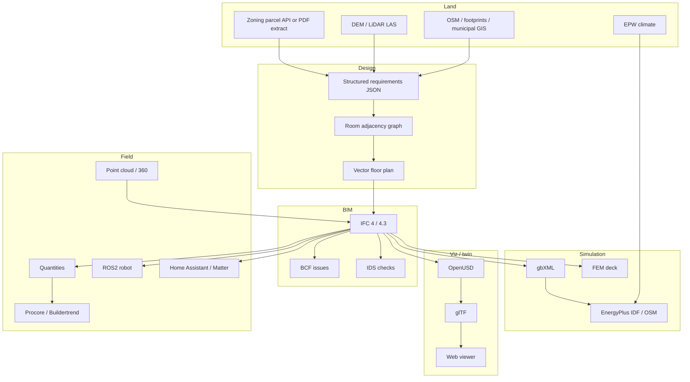

# Integration map

How systems *could* talk. This is a conversion map, not a chosen architecture.

---

## Realistic conversion paths

---

## Edge notes

| From | To | Vehicle | What survives | What dies |
|---|---|---|---|---|
| GIS | Site envelope | GeoJSON + CRS transform | Boundary, setbacks if encoded | Most zoning prose |
| Graph + boundary | Plan | HouseGAN++ / Finch / Hypar class | Adjacency, rough dims | Structure, codes, stairs, multi-storey |
| Plan | IFC | IfcOpenShell / Hypar / Bonsai authoring | Spaces, walls, doors if you write them | Automatic code objects, materials, MEP |
| IFC | glTF | IfcConvert / That Open / APS | Mesh + some props | Full IFC semantics, parametric history |
| IFC | USD | experimental mappings | Geometry composition | AEC classification unless a schema is added |
| IFC | EnergyPlus | gbXML or Honeybee | Envelope + zones if clean | Complex CAD junk, furniture |
| IFC | FEM | ifc2ca / manual | Structural members if present | Generative plans rarely have them |
| IFC | QTO | Ifc5D / OpenConstructionERP / ACC | Quantities if typed | Price, lead time |
| Photos | Mesh | COLMAP + Open3D | Appearance, coarse geom | Room types, IFC classes |
| Scan | IFC | human + ML assist | As-built shape | Semantic as-designed graph |
| BIM | Robot | IFC → SDF/USD + ROS2 | Collision world | Inspection semantics unless you add them |
| BIM | Smart home | room/zone IDs → Matter/HA | Spatial index | Device models are separate |

---

## Coordinate systems

This will break you if ignored.

- GIS: EPSG:4326 or a local projected CRS (e.g. UTM / MTM for BC)
- IFC: local engineering coords + `IfcSite` / `IfcProjectedCRS` / `IfcMapConversion`
- USD / glTF: y-up or z-up conventions differ
- ROS: right-handed z-up
- EnergyPlus: building north + site location

Pick one project CRS early. Store the transform, do not “eyeball” it.

---

## License collisions on a single path

Example of a path that is technically possible and legally messy:

`OSM (ODbL) + RPLAN-trained weights (research DUA) + Ladybug (AGPL) + Bonsai (GPL) + RSMeans prices (no-redistribution)`

That stack cannot be shipped as a closed SaaS without counsel. Track licenses per edge, not per demo.
