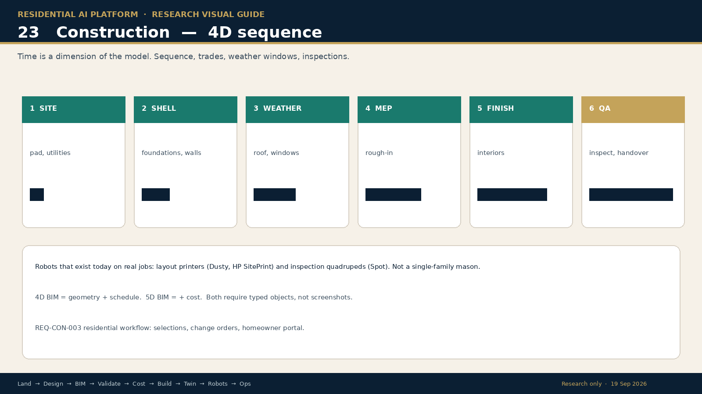

# 04 · Geom

**Slice:** production drafting on the plan sets builders already use  
**Site:** [geom.ai](https://geom.ai/)  
**Status:** out of stealth 18 September 2026. Seed $5M (Elad Gil & Co).

## What it does

Automates QC review, option solving, plan mirroring, elevation rendering, plot plans, and construction-document prep. Works on DWG / DXF / PDF / DWF. Pilots: Pulte, Century Communities, Meritage Homes, True Homes.

Claimed pilots: plan mirroring weeks → minutes (73% cost cut); 300-plan sheet-set rebuild in 20 minutes vs 2–3 days.

## Product still

Geom is days old. No public product UI is republished here. Use the official site.

Geom lives on construction documents, not on greenfield generative design.

## Fits our map

- Construction documents
- Option solving
- Plot plans

## Limits

Not a site-feasibility tool. Not a room-graph generator. Data stays per-builder (they state no cross-company training).

## Official demo

https://geom.ai/
